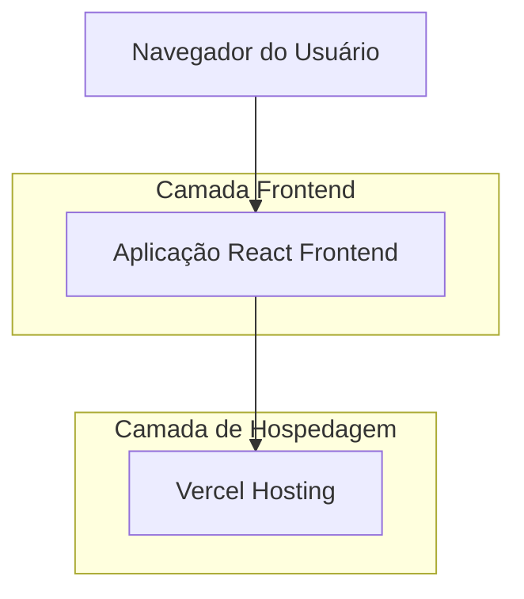

# Documento de Arquitetura Técnica - Landing Page DÜRKS

## 1. Design da Arquitetura



## 2. Descrição da Tecnologia

* Frontend: React\@18 + TailwindCSS\@3 + Vite

* Hospedagem: Vercel

## 3. Definições de Rotas

| Rota | Propósito                                            |
| ---- | ---------------------------------------------------- |
| /    | Página principal da landing page com todas as seções |

## 4. Estrutura de Componentes

### 4.1 Componentes Principais

```typescript
// Estrutura de componentes React
interface LandingPageProps {
  title: string;
  description: string;
}

interface ServiceItem {
  icon: string;
  title: string;
  description: string;
  features: string[];
}

interface ContactInfo {
  email: string;
  phone: string;
  message: string;
}
```

### 4.2 Estrutura de Dados

```typescript
// Dados da empresa
interface CompanyData {
  name: string;
  tagline: string;
  description: string;
  purpose: string;
  services: ServiceItem[];
  contact: ContactInfo;
}

// Exemplo de dados
const companyData: CompanyData = {
  name: "DÜRKS Consultoria e Engenharia",
  tagline: "Engenharia técnica para resultados reais no Agro e na Indústria",
  description: "A DÜRKS é uma consultoria especializada em engenharia aplicada...",
  purpose: "Transformar conhecimento técnico em soluções práticas...",
  services: [
    {
      icon: "🔧",
      title: "Consultoria aplicada à engenharia",
      description: "Soluções técnicas especializadas",
      features: [
        "Suporte à gestão e estruturação de fluxos",
        "Cálculos técnicos e dimensionamento",
        "Simulações estruturais",
        "Desenvolvimento de produtos",
        "Padronização com foco em eficiência",
        "Projetos técnicos detalhados"
      ]
    },
    {
      icon: "🏗",
      title: "Projetos especiais e soluções sob medida",
      description: "Desenvolvimento personalizado",
      features: [
        "Orçamentação de equipamentos personalizados",
        "Equipe dedicada para projetos especiais",
        "Soluções rápidas e alinhadas"
      ]
    }
  ],
  contact: {
    email: "durksengenharia@gmail.com",
    phone: "(55) 99194-8969",
    message: "Descubra como a DÜRKS pode agregar valor real ao seu projeto"
  }
};
```

## 5. Estrutura de Arquivos

```
src/
├── components/
│   ├── Hero.tsx
│   ├── About.tsx
│   ├── Services.tsx
│   ├── Purpose.tsx
│   ├── Contact.tsx
│   └── Layout.tsx
├── data/
│   └── company.ts
├── styles/
│   └── globals.css
├── App.tsx
└── main.tsx
```

## 6. Configurações de Deploy

### 6.1 Vercel

```json
{
  "name": "durks-landing-page",
  "version": 2,
  "builds": [
    {
      "src": "package.json",
      "use": "@vercel/static-build"
    }
  ],
  "routes": [
    {
      "src": "/(.*)",
      "dest": "/index.html"
    }
  ]
}
```

### 6.2 Otimizações

* Lazy loading de imagens

* Minificação automática via Vite

* Compressão de assets

* SEO otimizado com

