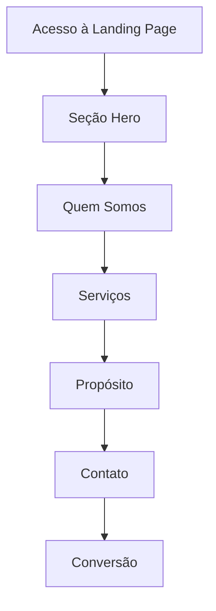

# Documento de Requisitos do Produto - Landing Page DÜRKS

## 1. Visão Geral do Produto

Landing page moderna e profissional para a DÜRKS Consultoria e Engenharia, empresa especializada em engenharia aplicada para o agronegócio e setor industrial. A página tem como objetivo apresentar os serviços da empresa, estabelecer credibilidade e gerar leads qualificados através de um design atraente e informações claras sobre as soluções oferecidas.

## 2. Funcionalidades Principais

### 2.1 Papéis de Usuário

| Papel | Método de Acesso | Permissões Principais |
|-------|------------------|----------------------|
| Visitante | Acesso direto via URL | Visualizar conteúdo, entrar em contato |

### 2.2 Módulo de Funcionalidades

Nossa landing page da DÜRKS consiste nas seguintes seções principais:
1. **Seção Hero**: apresentação da marca, slogan principal e call-to-action
2. **Seção Quem Somos**: descrição da empresa e área de atuação
3. **Seção Serviços**: detalhamento dos principais serviços oferecidos
4. **Seção Propósito**: missão e valores da empresa
5. **Seção Contato**: informações de contato e formulário

### 2.3 Detalhes das Páginas

| Nome da Página | Nome do Módulo | Descrição da Funcionalidade |
|----------------|----------------|-----------------------------|
| Landing Page | Seção Hero | Exibir logo DÜRKS, título principal "Engenharia técnica para resultados reais no Agro e na Indústria", botão de contato |
| Landing Page | Seção Quem Somos | Apresentar descrição da empresa, área de atuação nacional, especialização em engenharia aplicada |
| Landing Page | Seção Serviços | Listar consultoria aplicada à engenharia e projetos especiais com ícones e descrições detalhadas |
| Landing Page | Seção Propósito | Destacar missão de transformar conhecimento técnico em soluções práticas |
| Landing Page | Seção Contato | Exibir email, telefone, formulário de contato e call-to-action final |

## 3. Processo Central

O fluxo principal do usuário na landing page segue uma jornada linear de descoberta e conversão:

1. **Chegada**: Usuário acessa a página através de marketing digital ou busca orgânica
2. **Apresentação**: Visualiza a seção hero com proposta de valor clara
3. **Conhecimento**: Lê sobre a empresa na seção "Quem Somos"
4. **Serviços**: Explora os serviços oferecidos nas duas categorias principais
5. **Propósito**: Compreende a missão e valores da empresa
6. **Conversão**: Entra em contato através do formulário ou informações diretas

## 4. Design da Interface do Usuário

### 4.1 Estilo de Design

- **Cores primárias**: Azul profissional (#1e3a8a), cinza escuro (#374151)
- **Cores secundárias**: Branco (#ffffff), cinza claro (#f3f4f6), verde destaque (#059669)
- **Estilo dos botões**: Arredondados com gradiente sutil e efeito hover
- **Fonte**: Inter ou similar, tamanhos 16px (corpo), 24px (subtítulos), 36px (títulos)
- **Layout**: Design limpo com cards, navegação fixa no topo
- **Ícones**: Estilo outline moderno, consistentes com a identidade visual

### 4.2 Visão Geral do Design das Páginas

| Nome da Página | Nome do Módulo | Elementos da UI |
|----------------|----------------|----------------|
| Landing Page | Seção Hero | Background gradiente, logo centralizado, título em destaque, botão CTA azul |
| Landing Page | Quem Somos | Layout duas colunas, texto à esquerda, imagem/ícone à direita |
| Landing Page | Serviços | Cards com ícones, títulos e listas de serviços, layout grid responsivo |
| Landing Page | Propósito | Seção centralizada com destaque visual, background diferenciado |
| Landing Page | Contato | Formulário estilizado, informações de contato em cards, mapa opcional |

### 4.3 Responsividade

A landing page será mobile-first com adaptação completa para desktop. Otimizada para interação touch em dispositivos móveis, com navegação simplificada e botões de tamanho adequado para toque.